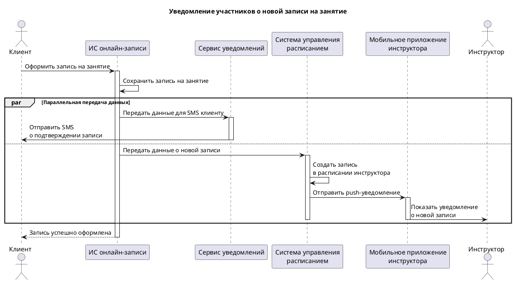

---
title: Диаграмма последовательности
sidebar_position: 2
description: Sequence-диаграмма уведомления участников о новой записи на занятие.
---

# Диаграмма последовательности

Ниже представлена sequence-диаграмма сценария уведомления участников о новой записи на занятие.

## Краткое описание

После оформления записи система онлайн-записи сохраняет информацию о занятии и инициирует два параллельных действия:

- отправляет данные в сервис уведомлений для SMS клиенту;
- передает данные в систему управления расписанием, где создается запись в расписании инструктора;
- отправляет push-уведомление в мобильное приложение инструктора.

В результате клиент получает подтверждение записи, а инструктор — уведомление о новом занятии.
