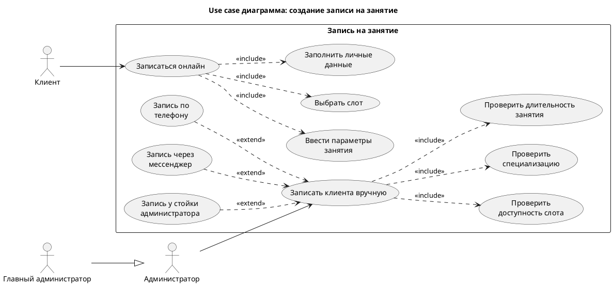

---
title: Диаграмма вариантов использования
sidebar_position: 1
description: Use Case диаграмма процесса создания записи на занятие.
---

# Диаграмма вариантов использования

Ниже представлена Use Case диаграмма процесса создания записи на занятие.

## Краткое описание

Диаграмма показывает два основных способа создания записи на занятие:

- онлайн-запись клиентом;
- ручную запись администратором.

Также на диаграмме отражены:

- основные участники процесса;
- включаемые действия при создании записи;
- варианты расширения ручной записи через разные каналы обращения клиента.
